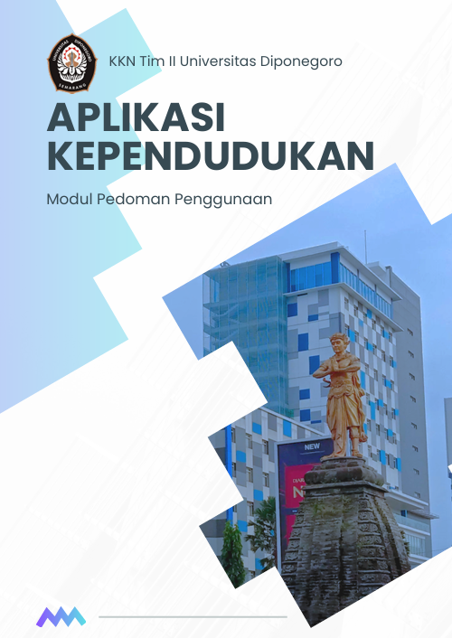

# Aplikasi-Kependudukan-Langenharjo

## Project Overview
This project aimed to reduce administrative workload and improve data accuracy for village officials. By developing a Microsoft VBA-based application within Excel to automate population administration for Langenharjo, Central Java, Indonesia. Key features include efficient creation, reading, updating, and deletion (CRUD) of resident data, automated official documents generation (e.g., covering letters, deceased and birth Notification letters), along with data summaries for informed decision-making. Completed as part of an individual-level monodisciplinary voluntary project in the context of KKN Tim II Universitas Diponegoro 2024.

[This Project is mainly inspired by the works of](https://www.youtube.com/@EAProject).

With some added features namely in document generation and customized to fit stakeholders' need.

[Access detailed documentation here](https://github.com/dzakialaqsha/Aplikasi-Kependudukan-Langenharjo/blob/main/Modul%20Aplikasi%20Kependudukan_compressed.pdf)

